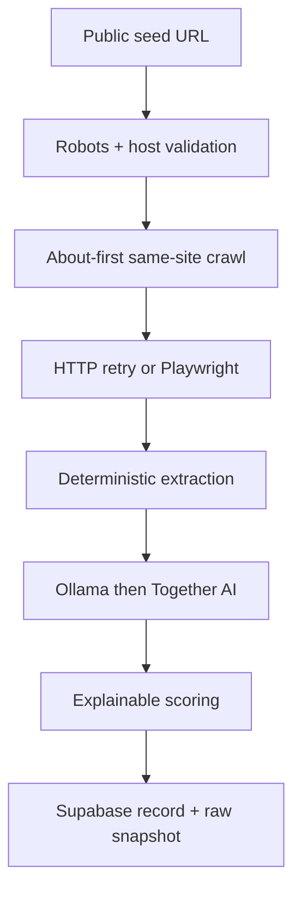

# Warm Prospect Radar

Warm Prospect Radar is a scraper-first business research workspace. It acquires public company sources, prioritises high-value pages such as About and Contact, extracts structured business data, calculates explainable starter scores, and preserves immutable evidence before any outreach work begins.

This milestone deliberately **does not send email, publish posts, comment, or message anyone**. The outreach package is present only as a disabled boundary for later work.

## What is implemented

- Synchronous Flask interface with a visible radar loading overlay.
- Shared Supabase backend or automatic local JSON fallback.
- Central `businesses` table with contact, website, social, run, snapshot, score, interaction, user, and audit satellites.
- UUID identifiers, UTC timestamps, ISO currency-ready data design, soft archives, and audit history.
- Wikipedia sample loader for ten large companies.
- Same-site crawling with About/company/contact/product priority, depth and page limits, robots rules, throttling, retries, and redirect validation.
- JavaScript-rendered page fallback through Playwright.
- Deterministic extraction of names, descriptions, official websites, Wikipedia infoboxes, JSON-LD organizations, founding dates, employee counts and ten size bands, contacts, public social links, products, technologies, and starter GICS sectors.
- Ollama `gemma3:1b` enrichment first, with Together AI as the configured fallback.
- Official adapters for Meta, LinkedIn, X, and GitHub when tokens are available; bounded public-page fallback otherwise.
- Immutable versioned JSON snapshots containing the acquired HTML, cleaned text, metadata, and structured record locally, with optional Supabase Storage upload.
- Search, GICS filtering, company detail, explainable scores, version downloads, refresh, archive, progress diagnostics, and safe settings summary.
- Tests for routes, repository operations, scoring, extraction, URL handling, and end-to-end versioning.

## Acquisition flow



The public-page fallback does not import browser cookies, automate login, solve CAPTCHAs, or bypass access controls. A blocked social page remains a recorded warning rather than causing the whole business acquisition to fail.

## Requirements

- Python 3.11 or newer; Python 3.12 is recommended.
- Arch Linux in WSL or native Windows.
- A Supabase project for shared multi-user data. Local mode works without one.
- Ollama for local extraction and/or a Together AI API key.
- Chromium installed through Playwright if JavaScript rendering is needed.

## Quick start on Arch Linux / WSL

```bash
cd /mnt/d/Downloads/Repositories/warm-prospect-radar
python -m venv .venv
source .venv/bin/activate
python -m pip install --upgrade pip
python -m pip install -r requirements.txt
python -m playwright install chromium
cp .env.example .env
python app.py
```

Playwright officially documents WSL and selected Debian/Ubuntu releases; Arch Linux is not in its listed Linux support matrix. First try the managed Chromium command above. If the browser binary cannot launch on Arch, install Arch's Chromium package and set its explicit path:

```bash
sudo pacman -S chromium
```

Then add `PLAYWRIGHT_EXECUTABLE_PATH=/usr/bin/chromium` to `.env`.

When neither browser is available, the HTTP acquisition still succeeds and the run records a JavaScript-fallback warning.

Open `http://127.0.0.1:5000` from Windows or WSL.

## Quick start on native Windows PowerShell

```powershell
Set-Location D:\Downloads\Repositories\warm-prospect-radar
py -3.12 -m venv .venv
.\.venv\Scripts\Activate.ps1
python -m pip install --upgrade pip
python -m pip install -r requirements.txt
python -m playwright install chromium
Copy-Item .env.example .env
python app.py
```

The application uses `pathlib`, so storage paths work with both Windows and Linux path conventions. Do not share one active local JSON file between Windows and WSL processes; configure Supabase when multiple users or processes need the same records.

## Supabase setup

1. Create a new Supabase project.
2. Open the SQL editor and run [`db/schema_v1.sql`](db/schema_v1.sql).
3. Run [`db/functions_v2.sql`](db/functions_v2.sql).
4. Copy `.env.example` to `.env`.
5. Set:

```dotenv
DATA_BACKEND=auto
SUPABASE_URL=https://your-project.supabase.co
SUPABASE_KEY=your-key
SUPABASE_BUCKET=business-snapshots
```

`auto` selects Supabase only when both values exist; otherwise it uses `fileStorage/json/local_database.json`. To require Supabase and fail fast when it is unavailable, use `DATA_BACKEND=supabase`.

The requested schema has Row Level Security disabled. That allows shared records without an RLS policy layer, but it is not suitable for an internet-facing deployment. Keep the Flask service on a trusted machine/network, never put a service-role key in browser JavaScript, and add authentication plus RLS before public deployment.

Raw snapshot upload to Supabase Storage is off by default:

```dotenv
SUPABASE_UPLOAD_RAW=false
```

Set it to `true` only when the server key or Storage policies allow private bucket writes. Structured records are still stored in Supabase when raw upload is disabled; the complete raw snapshot remains under `fileStorage/json/snapshots/`.

## Ollama and Together AI

Start Ollama in WSL and pull the selected model:

```bash
ollama pull gemma3:1b
ollama serve
```

The defaults are:

```dotenv
ENABLE_LLM=true
LLM_PROVIDER_ORDER=ollama,together
OLLAMA_BASE_URL=http://127.0.0.1:11434
OLLAMA_MODEL=gemma3:1b
TOGETHER_API_KEY=
TOGETHER_MODEL=meta-llama/Llama-3.2-3B-Instruct-Turbo
```

Deterministic extraction always runs first. If Ollama is unavailable, Together AI is tried when its key is present. If both are unavailable, the useful deterministic result is saved with provider warnings.

## Social acquisition configuration

Discovered public profiles are bounded by `SCRAPER_SOCIAL_PROFILE_LIMIT`. Official methods are attempted when their variables exist:

```dotenv
META_ACCESS_TOKEN=
X_BEARER_TOKEN=
LINKEDIN_ACCESS_TOKEN=
LINKEDIN_ORGANIZATION_ID=
LINKEDIN_API_VERSION=202501
GITHUB_TOKEN=
ALLOW_PUBLIC_SOCIAL_FALLBACK=true
SCRAPER_SOCIAL_PROFILE_LIMIT=4
```

Official API identifiers and permissions vary by platform. When an official call is unavailable, the application may read the profile's public HTML only. It does not maintain session cookies.

## Load Wikipedia test businesses

List the default targets without making requests:

```bash
python db/sample_data_loader.py --list-only
```

Load three companies without LLM enrichment:

```bash
python db/sample_data_loader.py --limit 3 --no-llm
```

Load selected pages:

```bash
python db/sample_data_loader.py --company "Apple Inc." --company "Microsoft"
```

The loader continues after an individual failure and reports the saved/failed total. Running it again refreshes matched records and creates new snapshot versions.

## Starter scoring model

The current product hypothesis is implemented transparently:

- **Prospect likelihood** = 80% size accessibility + 20% contactability. Size accessibility decreases logarithmically as employee count increases.
- **Prospect score** = 65% response strength + 25% difficulty value + 10% data completeness.
- **Difficulty value** = 100 − prospect likelihood.

With no outreach interactions, response strength is zero. Large test companies can therefore have low likelihood but some difficulty value. Later reply records can be inserted through `record_prospect_interaction(...)`, which recalculates and preserves score history.

## Run and test

```bash
python app.py
pytest
ruff check .
```

Health and data endpoints:

- `GET /api/health`
- `GET /api/businesses?q=...&sector=...`
- `POST /api/scrape` with JSON `{"url":"https://...","business_name":"Optional"}`

## Project structure

```text
db/                 Supabase schema, functions, and Wikipedia loader
fileStorage/        Local JSON snapshots, media, and future templates
src/frontend/       Flask routes, templates, CSS, JavaScript, and media
src/scraper/        Crawl, extraction, LLM, social, and pipeline modules
src/outreach/       Explicitly disabled future milestone boundary
tests/              Unit, route, persistence, and pipeline tests
app.py              Development entry point
```

The original `src/scraper/webpape.py` path is retained as a compatibility import, while corrected code lives in `src/scraper/webpage.py`. Existing top-level folders were not moved or reorganised.

## Current boundaries

- Requests execute synchronously so the user sees a loading overlay and receives the final result in the same browser request.
- Refresh is manual; no scheduler is installed. A once-daily job can be added after source volume and runtime are known.
- No outbound outreach is performed.
- No login, cookie harvesting, CAPTCHA handling, proxy rotation, or access-control bypass is implemented.
- GICS sector extraction is a transparent starter classifier; narrow GICS industry codes should be reviewed or supplied by a licensed classification source before production decisions.
